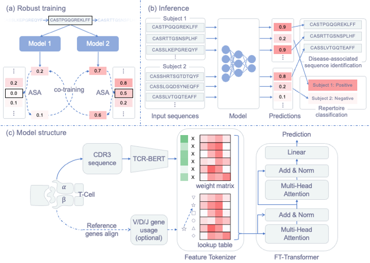

# NoisyLabelLearning4Repertoire
This repository holds the Pytorch implementation for the method described in the paper:
> A Noisy-Label-Learning Formulation for Immune Repertoire Classification and Disease-Associated Immune Receptor Sequence Identification.
Mingcai Chen, Yu Zhao, Bing He, Zhonghuang Wang, and Jianhua Yao.
The 32nd International Joint Conference on Artificial Intelligence (IJCAI 23) 

# Requirement 

    python==3.6.8
    scikit-learn==0.23.2
    torch==1.7.0+cu101
	transformers==4.28.1

# Data Preparation
We use two datasets in our paper for demonstration: 1) [CMV dataset](https://clients.adaptivebiotech.com/pub/emerson-2017-natgen) and 2) [Cancer dataset](https://github.com/s175573/DeepCAT/tree/master/TrainingData).

## Data preprocessing 
We provide the extracted embedding for the CMV data set in [here](data/cmv/), which can be directly used for the training of our model.
To generate the embedding Cancer dataset, after downloading the [Cancer dataset](https://github.com/s175573/DeepCAT/tree/master/TrainingData) and put it in the data/deepcat/ folder, run:

    python3 preprocess.py

# Training:
With downloaded and processed datasets, you can train the model by run:

    python3 train_CMV.py/train_Cancer.py
            --dataset_dir               # data directory

            # training schema hyper-parameters
            --batch_size *              # batch size
            --lr *                      # learning rate
            --epoch *                   # number of training epochs
            --warm_epoch *              # number of epochs for warm model up

            # model architecture hyper-parameters
            --n_layers *                
            --n_heads *                 
            --d_token *               
            --attention_dropout * 
            --ffn_dropout * 
            --residual_dropout *   

            # method-related hyper-parameters
            --ema *                     # the EMA coefficient in our method 
            --label_smoothing *         # the label smoothing coefficient in our method

## Runing examples

(1) For CMV dataset:

    python3 train_CMV.py --dataset_dir dataset/CMV/ --batch_size 256 --lr 0.005 --epoch 100                   --warm_epoch 15 --n_layers  1 --n_heads 1 --d_token 1 --attention_dropout 0 --ffn_dropout 0 --residual_dropout 0 --ema 0.99 --label_smoothing 0.7

(2) For Cancer dataset:

    python3 train_Cancer.py --dataset_dir dataset/CMV/ --batch_size 256 --lr 0.0005 --epoch 200                   --warm_epoch 8 --n_layers  1 --n_heads 4 --d_token 192 --attention_dropout 0.1 --ffn_dropout 0.1 --residual_dropout 0.1 --ema 0.95 --label_smoothing 0.4

# Disclaimer

This tool is for research purposes and is not approved for clinical use.

This is not an official Tencent product.

# Coypright

This tool is developed in Tencent AI Lab.

The copyright holder for this project is Tencent AI Lab.

All rights reserved.

# Citation

Please consider citing our paper in your publications if the project helps your research.
